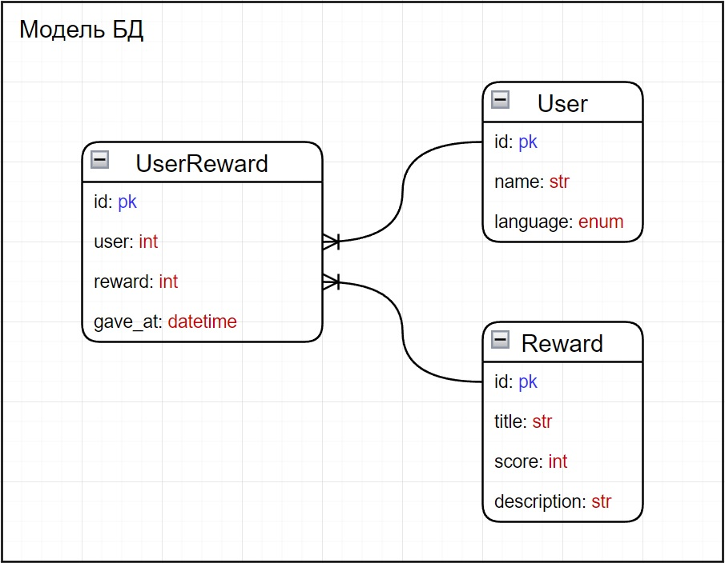

## Тестовое задание для АО НПЦ «ЭЛВИС»

## О проекте

#### Проект является API добавления пользователей, достижений, присваивания достижений пользователям, а также получения данных п пользователях и достижениях по некоторым параметрам.

### Стек технологий
 


### Схема базы данных
<p align="center"></p>

## Установка

### Клонировать репозиторий
```bash
$ git clone git@github.com:SivikGosh/test_elvis.git
```

### Перейти в директорию compose-файла и подготовить файлы конфигурации
```bash
$ cd elvis_compose/
$ cp .env.example .env
```

### Файлы концигурации
```bash
# .env

DB_HOST=db          # контейнер БД
DB_PORT=5432        # порт контейнера
DB_NAME=postgres    # имя базы данных
DB_USER=postgres    # имя пользователя базы данных (он же POSTGRES_USER)
DB_PASS=postgres    # пароль пользователя базы данных (он же POSTGRES_PASSWORD)

POSTGRES_USER=postgres
POSTGRES_PASSWORD=postgres

SECRET=1qazxsw2     # секретный ключ,
                    # который используется для выполнения POST-апросов.
                    # указывается в качестве параметра запроса.
                    # примеры:
                    # http://localhost/users/?secret=1qazxsw2
                    # http://localhost/rewards/?secret=1qazxsw2
                    # http://localhost/rewards/reward_user/?secret=1qazxsw2

```

```bash
# nginx.conf

server {
    listen 80;
    server_name localhost;  # localhost заменить на домен или ip целевого сайта

    location / {
        proxy_pass http://backend:7000/;
        proxy_set_header Host $host;
        proxy_set_header X-Real-IP $remote_addr;
        proxy_set_header X-Forwarded-For $proxy_add_x_forwarded_for;
        proxy_set_header X-Forwarded-Proto $scheme;
    }
}
```

```bash
# docker-compose.yml

version: '3.8'

services:
  
  db:
    image: postgres:16.1-alpine3.19
    volumes:
      - db_data:/var/lib/postgresql/data/
    env_file:
      - ./.env
    ports:
      - 5432:5432

  backend:
    build:
      context: ../app/
    env_file:
      - ./.env
    volumes:
      - logs:/app/logs/
    depends_on:
      - db
    restart: always

  nginx:
    image: nginx:1.19.3
    ports:
      - 7000:80  # заменить 7000 на нужный порт целового сайта
    volumes:
      - ./nginx.conf:/etc/nginx/conf.d/default.conf
    depends_on:
      - backend

volumes:
  db_data:  # база данных
  logs:     # логи

```

## Результаты

### Пункты
#### Основные задачи
    ✔️ предоставлять информацию о пользователе

    ✔️ предоставлять информацию о всех доступных достижениях

    ✔️ добавлять достижения

    ✔️ выдавать достижения пользователю с сохранением времени выдачи
        (сохранять связь пользователя с достижением и датой выдачи)

    ✔️ предоставлять информацию о выданных пользователю достижениях на выбранном пользователем языке

    ✔️ предоставлять статистические данные системы
        ✔️ пользователь с максимальным количеством достижений
        ✔️ пользователь с максимальным количеством очков достижений
        ✔️ пользователи с максимальной разностью очков достижений
        ✔️ пользователи с минимальной разностью очков достижений
        ✔️ пользователи, у которых достижения выдавались 7 дней подряд

#### Опциональные задачи
    ✔️ составить docker compose файл для развертывания сервера и всех его компонентов(к примеру, СУБД)

    ✔️ одним из компонентов развертывания должен быть сервер nginx через который организует reverse proxy доступ к серверу
  
    ✔️ показать навыки оформления проекта
        ✔️ комментарии к функциям
        ✔️ логирование
        ✔️ написание read.me

    ▪︎ сделать front-end для работы с сервером (интерфейс к одной или нескольким функциям,
      например для добавления достижения или вывода достижений пользователя по его имени)

    ▪︎ показать умение работать с историей git

    ▪︎ показать умение составления документации (например, оформить описание внешних интерфейсов сервера)

    ▪︎ проявить фантазию в именовании достижений и их описании

    ▪︎ показать умение тестировать разработанный код

### Адрес итогового проекта

#### Проект развёрнут на рабочем сервере и доступен по адресу: http://eventfun.ru:7000/
